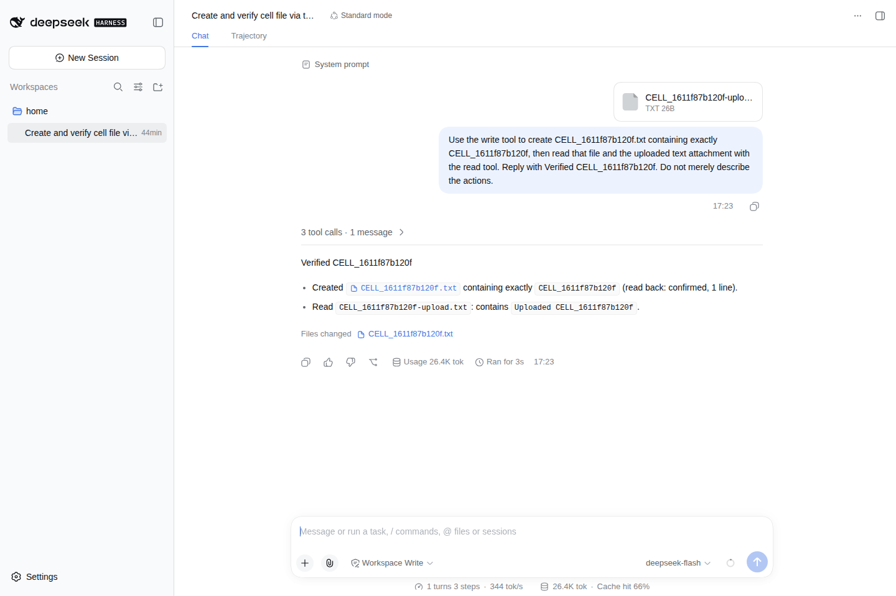
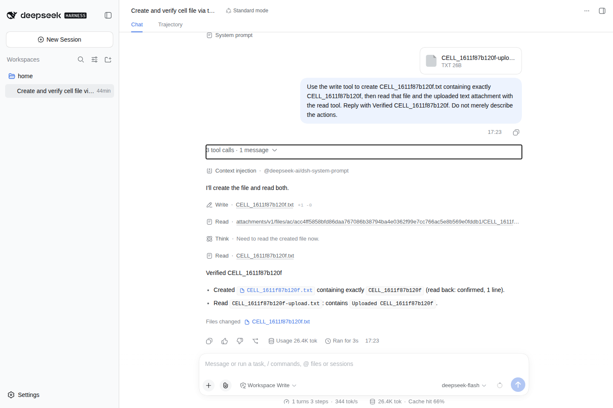

# dsh-isolated-runtime

原生 DeepSeek Harness 的 Kubernetes Cell 生命周期与隔离运行时。[多租户平台](https://github.com/GuoMonth/dsh-multi-tenant/blob/main/README.zh-CN.md) 负责 OIDC、成员、用户协议和会话；本仓库负责 Cell 资源、镜像、精确实例校验与受限内部 Connector。DSH 负责原生 Web 和工具。

[English](README.md)

**当前是 Cell MVP alpha。** 固定版本下的双用户 OIDC + Cell、真实模型文件操作已通过[集成回归](https://github.com/GuoMonth/dsh-multi-tenant/blob/4ba252765bccb41314c0bdc6b11bcf60cc0b33ef/docs/evidence/cell-regression-2026-09-20.md)。这批已验收的 Linux/amd64 Cell/Operator 镜像已按相同 digest 公开于 [v0.3.0-alpha.1](https://github.com/GuoMonth/dsh-isolated-runtime/releases/tag/v0.3.0-alpha.1)；平台 npm 独立发行。允许破坏性变更，不承诺历史兼容、升级、HA 或无感恢复。

## 固定发行边界

依赖的 DSH 明确为 **0.1.5-rc.2**，源码 **`fb2c4b9e698e30edb738bca4cf0618587db7d203`**。每次发行锁定可公开拉取的 Cell、Operator 镜像 `@sha256` digest，并在平台 `cell-release.json` / runtime `release.json` 中记录匹配的运行时源码与 DSH 身份；实际部署的平台镜像也固定 digest。npm `latest` 只用于安装时选择包，不让运行中的镜像标签或 DSH 版本范围漂移。

允许破坏性更新：新迭代明确新的固定组合，按需修改配置/状态要求并验证受影响链路，不要求兼容层、历史升级或迁移承诺。已发布制品身份不改写。公开的 [v0.3.0-alpha.1 清单](https://github.com/GuoMonth/dsh-isolated-runtime/releases/download/v0.3.0-alpha.1/release.json) 已记录本次 Linux/amd64 的 Cell/Operator 组合。空值或不匹配 digest 仍会阻止平台发行。


## 与平台配合

管理员准备 K8s、执行 NetworkPolicy 的 CNI、存储、租户 namespace、Gateway API 和 DNS/TLS。渲染已有平台配置，替换域名并固定 Operator 镜像 digest，再审阅部署：

```bash
kubectl kustomize config/platform > /private/operator-rendered.yaml
# 应用前必须替换示例域名及可变镜像占位符。
```

`--access-mode=platform` 不创建 standalone 用户认证器或直达 Cell 的 HTTPRoute。授权由平台执行，再通过 Connector 访问已校验的具体实例。见[平台接入配置](docs/platform-access.md)及联动的[内测启动指南](https://github.com/GuoMonth/dsh-multi-tenant/blob/main/docs/reference/quickstart.md)。

平台新 alpha 发布后，Node 24+ 的入口是：

```bash
npx dsh-multi-tenant@latest start --config /private/config.json
```

进程必须能直达 API 和 Pod IP，推荐在集群内运行；它不自动建集群。**不需要同时执行 `npx dsh-isolated-runtime start`**，后者是另一套 standalone 本地安装入口，不负责此平台的资源控制。

| 层 | 权威边界 |
| --- | --- |
| multi-tenant | OIDC、可信成员、父子会话、分配意图与协议准入 |
| isolated-runtime | Cell Operator、镜像、资源生命周期/归属、已校验访问通道 |
| DSH | 原生应用会话、工具、模型调用和应用私有状态 |

一个集群、上层单副本、固定版本。中立内部契约不承诺 Process/Docker 可互换。未知写结果查原 key；接受删除不等于 writer 已停止。见[项目宪法](CONSTITUTION.md)、[RuntimePort](docs/design/runtime-port.zh-CN.md)和[MVP 边界](docs/alpha-mvp.zh-CN.md)。

## 真实集成画面

平台 OIDC 后的原生 DSH，运行在本仓库管理的 Cell；deepseek-flash 完成文件写入/读取及附件读取。项目不提供模型凭据。





[完整证据与限制](https://github.com/GuoMonth/dsh-multi-tenant/blob/4ba252765bccb41314c0bdc6b11bcf60cc0b33ef/docs/evidence/cell-regression-2026-09-20.md) · [发行分工](docs/distribution.md) · [开发贡献](CONTRIBUTING.md)。

## 历史 standalone 发行

已发布 `v0.2.0-alpha.1` 是 standalone 本地启动器，不是本次集成 alpha。请使用它的[版本化说明](https://github.com/GuoMonth/dsh-isolated-runtime/tree/v0.2.0-alpha.1)。之后授权发布的 npm 版本统一使用 latest；通道选择不表示稳定承诺。启动器仍绑定不可变发行身份，不在每次启动选择新的运行时镜像。

[文档索引](docs/README.md) · [DSH 精确基线](compat/dsh/README.md) · [架构](docs/specs/architecture.md)。许可证见 [LICENSE](LICENSE)。
