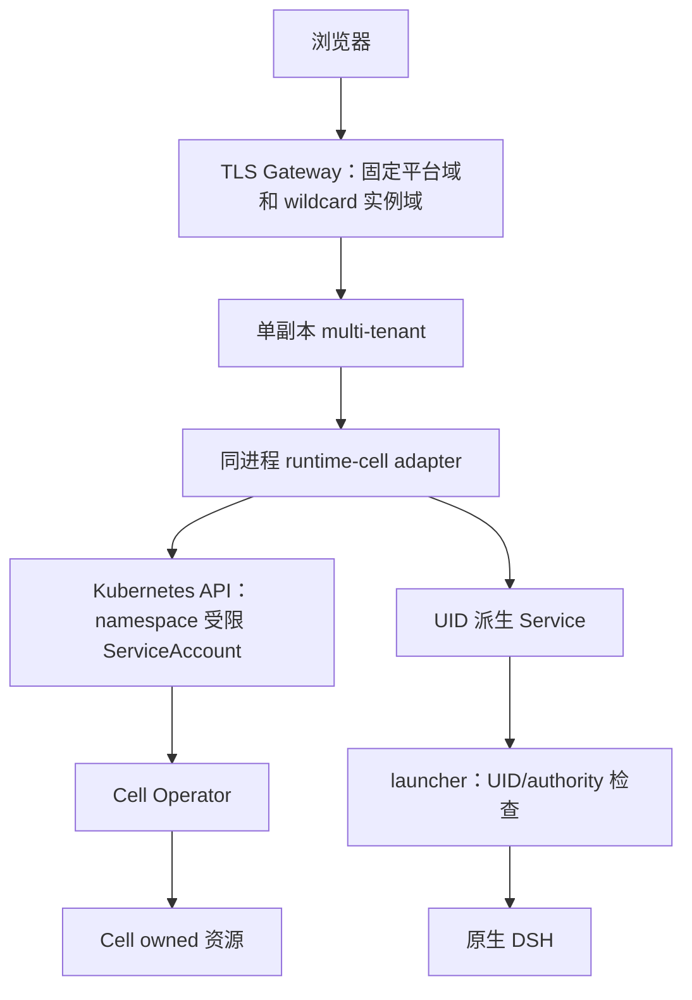

# Cell 对 Runtime Contract v1alpha1 的实现映射

状态：**Proposed / 待审阅，未实现**。规范：[中立契约](runtime-contract-v1alpha1.zh-CN.md)。本文件只描述第一种实现，不能反向给公共契约增加 Kubernetes 字段。

## 1. 现状与差异

基准：`4153dd468e34b5f73ccf576323519d81b6e10549`。

| 现有代码 | 已有行为 | 本提案需要的增量 |
| --- | --- | --- |
| `api/v1alpha1/types.go` | CellSpec 有 image/storage/securityClass，无持久暂停或退役意图 | 可选、不可变 integration 归属；单调 retirement 意图及可观测结果 |
| `internal/controller/resources.go` | UID 派生资源、data Retain/ Delete、private PVC 单独归属 | 集成模板创建时保留 data 和 private-state；不要改变原 standalone 默认 |
| `internal/controller/cell_controller.go` | 调谐原生资源/Ready；删除分支不提供完整退役状态 | 退役分支及明确 writer-stop 完成屏障 |
| `internal/controller/gateway.go` | Cell UID 域名直连 Service，独立 OIDC/RBAC | 集成模式不用该直达公网 route，TLS wildcard route 指向平台 |
| `internal/accesscontract/config.go` | 公网 authority 和 Gateway route 绑定 | 把 authority 策略与“是否创建直达 route”分离 |
| `internal/dshcompat/launcher/launcher.go` | 内存 token、保持外部 Host、剥离部分凭据 | 集成模式核对目标 UID/authority，剥离平台保留凭据 |

这些差异不能通过在上层返回一个 Service URL 解决。也不需要 fork DSH 或实现新的 Session 协议。

## 2. 部署与所有权

首期 runtime adapter 是一个 TypeScript 库，源码归运行时仓库，通过精确版本/本地制品进入 multi-tenant 组合根；不新增运行时 daemon。所有 K8s SDK、资源命名和错误翻译留在 adapter 内。

平台主服务不直接写 Pod、StatefulSet、PVC、NetworkPolicy、RoleBinding 或 Cell status。平台的服务身份仅在管理员登记 namespace 获得 Cell 创建/读取/退役意图修改权限，以及入口解析所需 Service 只读权限；不需要 Namespace/Secret 全局读写、Pod exec 或 cluster-admin。具体 Role 由管理员部署，不能让浏览器选择 namespace。

Operator 仍拥有派生资源生命周期。Cluster 管理员拥有 namespace、RBAC、CNI、存储和 Gateway/TLS 配置。平台是可信控制面，其适配器的服务权限不是对失陷平台进程的隔离边界。

## 3. 资源映射

| 中立字段 | Cell 映射 | 约束 |
| --- | --- | --- |
| runtimeId | 安装配置，并在集成归属中固定 | 重装不冒用旧安装身份 |
| scopeId | 管理员配置到 namespace 的唯一稳定映射 | Cell 不再存第二个 tenant/scope 字段 |
| instanceKey | `Cell.metadata.name = ri-<UUID>` | 不同分配新 key，不复用 |
| incarnation | Cell.metadata.uid | 只有 adapter 理解 UID |
| ownerRef | 建议 `spec.integration.ownerRef` | 创建后 CEL 验证不可变，不承载 OIDC 数据 |
| templateRef | 建议 `spec.integration.template` | 创建后不可变，必须匹配获准构建/profile |
| revision | resourceVersion 原样 opaque | 不解析成数，不当作 fencing |
| Provisioning/Ready/Unavailable | observedGeneration + 当前 Conditions + 模板验证 | 旧 generation 的 Ready 不放行 |
| Retiring/Retired | 新增退役意图与结果 | 不以 deletionTimestamp/404 代表停止完成 |

建议可选 `spec.integration` 包含 runtimeId、ownerRef、templateRef；instanceKey 已编码在名称里，不重复存一份。其存在决定该 Cell 使用集成契约，并且存在性/值不可变。命名与字段最终 Go/CRD 定义在 S3 落地，语义在 S0 固定。

建议 `spec.lifecycle` 只在 integration Cell 支持 `Active`（默认）→`Retired` 单向变化；不新增暂停。`status.retirement` 给出 `Retiring | Retired`、reason、observedGeneration；继续保持现有 Ready 条件，退役期间为 false。CRD 验证拒绝反向激活和同 key 改归属/模板，不能只靠 TS 类型约束。

这是现有 Cell 的增量，不新增 Instance CRD、ConfigMap 请求日志或 SQLite runtime 数据库。普通 standalone Cell 不自动进入此生命周期，不静默改变已发布删除行为。

## 4. create / get

1. scope 配置查 namespace，验证 namespace 在服务 allowlist 中；templateRef 由受控配置解析到固定 image digest、profile、storage/security 参数。
2. 发送精确 Cell 创建；AlreadyExists 后读取并逐项核对 installation、name、ownerRef、templateRef 和实际资源意图。不同归属/模板拒绝，不做“认领式” server-side apply。
3. Kubernetes 对 Cell 创建的持久接受就是 create 的线性化点；UID 成为 incarnation。
4. 平台超时后重读相同名称，必要时重发相同 create。Retired Cell 仍在，重试只得到终态，不会复活。
5. get 从 API 读取当前 Cell；status 若未观察最新 generation，不返回 Ready。平台重启只重读；不通过重建 Cell 修复不确定状态。

模板 registry 初期为安装配置中的单条不可变映射；adapter 和 Operator 必须共享可校验的修订/构建约束。仅在平台 UI 做模板检查不算运行时保证。Operator 在创建派生资源前验证 integration 模板/实际 spec 一致，不符合则不启动；涉及 CRD 不可变字段的变更由 CRD 拒绝。

## 5. retire：为什么保留 Cell CR

平台管理员操作先在平台撤销新准入并关闭自己持有的连接，再发送绑定确切 UID 的 retire。

adapter 先核对完整 ref，用含 UID/resourceVersion 前提的原子 patch（或 resourceVersion CAS update）写入 `spec.lifecycle=Retired`；并发冲突只重读同一 UID 后重试，不向同名新对象套用旧操作。没有原生资源 DELETE 权限也能完成该意图。

Operator 的退役分支顺序：

1. 观察最新退役意图，Ready=false，停止正常创建/恢复分支；删除精确 owned Service/公网入口（如有），阻止新访问。
2. 删除/停止精确 owned StatefulSet，按 UID 追踪旧实例子资源。**在旧 Pod 全部停止前保留 NetworkPolicy**，避免清理顺序让仍存活的进程突然暴露。
3. 使用不经 controller cache 的读取确认 owned StatefulSet 不再能产生 Pod，所有精确 owned 或携带该 Cell UID 的 Pod 消失；不依赖单次 replicas=0 或应用退出码。
4. 对未能证实 ownership、节点失联导致旧 writer 可能存活等情况保持 Retiring；不 force-delete 来伪造完成。管理员需通过部署本身的 fencing/故障处理证明安全，本期不自建节点 fencing 系统。
5. 保留 data/private PVC 并核对其 UID/归属；清理其余 owned 临时/访问资源。外部 provider Secret 从不由 retire 删除。
6. 确认没有本 controller 迟到的创建动作仍在途，再写 Retired。同一 key 的 reconcile 串行化、retirement 单调及新 generation 验证必须纳入测试；不能在后台保留脱离 reconcile 的异步 create。

Cell CR 留作少量终态元数据和原始 intent。生命周期退役不可逆；新 instanceKey 产生新卷，不自动导入已保留卷。现有 snapshot writer-stop 的核验原则可复用，但不调用快照流程来退役，不强制 CSI snapshot 前提。

MVP 代价是一小段退役调谐逻辑和 CR 状态扩展。替代方案“删 CR 再建 tombstone 表”多一个存储权威；“不记终态”无法兑现迟到 create 不复活。两者因此不作为推荐。

正常协议以外，管理员仍可能删除 CR/namespace、强制删 Pod 或改策略；这些动作会破坏假设，不能把我们的接口保证扩大到该情况。

## 6. resolveAccess 与集成数据通道

### 6.1 Mode 必须显式

安装选择 `standalone` 或 `platform` 访问模式，默认保持现有 standalone；同一 namespace 不能被两套不同模式的 Operator 同时控制。MVP 参考安装采用 platform。

platform 模式：

- Operator 仍配置与当前 UID 对应的 public authority 给 launcher，但不创建 Cell→Service 的直接公网 HTTPRoute。
- 管理员配置一条 wildcard Gateway route 指向平台入口。平台实例 origin 由 runtime adapter 返回，格式可沿用 Cell UID hostname；平台不解析 UID。
- 原有独立 Envoy OIDC + cell-authorizer + RoleBinding 用户授权链不在集成数据路径上。集成模式用户授权只在平台；Kubernetes Role 限制的是平台管理服务身份。
- platform/standalone 不在同一 Cell 上热切换；先不设计无感迁移。

### 6.2 一次连接怎样绑定目标

1. 平台验证用户会话与确切 Environment，然后调用 `resolveAccess(ref)`。
2. adapter fresh 读取 Cell、核对 UID、owner/template、未退役及 Ready，返回短期 binding 和规范 origin；私有保存此 binding 对应的连接上下文。
3. 平台在每次请求/upgrade 再次授权；Connector 在真实 dial 前核对 binding 未过期、ref 不变、Cell 未退役、派生 Service 的 owner UID/selector 与目标一致。
4. Connector 只能连接 runtime 推导且核验的 Service authority，禁止使用浏览器 URL/DNS、任意端口、外部 redirect 作为目标。
5. Connector 保留规范外部 Host/Origin，重建私有目标 UID 头；launcher 在集成模式与注入的本 Cell UID/authority 比对。不匹配拒绝，目标头转发给 DSH 前移除。
6. launcher 保持现有内存 launch-token exchange 和 DSH cookie 处理，不把 token 交给平台，不要求 platform 向 DSH 注入旧 provider cookie。

私有 UID header 不是密码或单独认证方案。NetworkPolicy 限制到管理员拥有的 platform namespace/Pod；租户不得创建那里带准入 label 的 Pod或拥有 hostNetwork/策略管理权限。Service selector/UID 检查和 launcher 目标检查共同避免误路由；恶意篡改 CNI、集群管理平面或已攻陷平台不在首期边界内。

默认不缓存用户授权，也不长期缓存 Ready。S1 先用请求级检查获得简单明确的行为；性能优化要保留同样的失败关闭语义，不能先上全局 informer 再把撤权一致性留作以后解决。

### 6.3 现有约束不能漏

现有 ingress 会替换 Host/Origin 并强制要求 runtime Cookie；新 Cell transport 不走这个私有假设。可抽出共享的 admission/stream cancellation，保留旧 Docker 路径回归，不能靠可选 cookie 字段无条件跳过鉴权。

现有 launcher 凭据过滤只知道 Envoy 的一组 Cookie/头；平台路径必须新增明确的保留名称处理，并验证响应无法覆盖 `__Host-` 平台 Cookie、父域 Cookie 或 bootstrap 凭据。应用内容仍不解析。

## 7. S1–S4 的实现边界

| 切片 | runtime 工作 | multi-tenant 工作 | 联合证明 |
| --- | --- | --- | --- |
| S1 | platform 访问模式、get/resolveAccess/Connector、launcher 目标检查 | admission 与 provider cookie 假设解耦，测试身份入口 | 原生 transports + 内部绕过拒绝 |
| S2 | 两 Cell 绑定/隔离 fixture | OIDC、host-only handoff、会话/撤权 | 两身份独立 origin；无双重 OIDC |
| S3 | integration 不可变绑定/模板检查/create | SQLite 环境绑定、创建查询 API | 重复/超时/平台重启不重建 |
| S4 | 单调退役及停止/保留屏障 | 管理员退役、错误/人工处理说明 | 终态重放、迟到 UID、文件会话保留 |

现有预建 standalone Cell 不自动 adopt 为 integration 记录；S1 测试使用显式创建的集成 fixture。后续采用新字段时保留旧对象兼容，必要时使用受控测试新建，而非清除用户状态。

## 8. 本设计明确不承诺

不承诺 memory checkpoint、应用 flush、Pod 无感恢复、强制节点断电后的自动 fencing、多副本平台、跨后端迁移、任意 ingress/CNI/CSI 组合。保留 PVC 是数据保留，不是备份。退役卡住可以人工排障，不能换成假成功。

验证入口需记录实际镜像/版本/存储/CNI；没有实际 CNI 隔离和 TLS/authority 验证，不能宣布集成模式可用。该限制没有扩大成全平台兼容矩阵。
