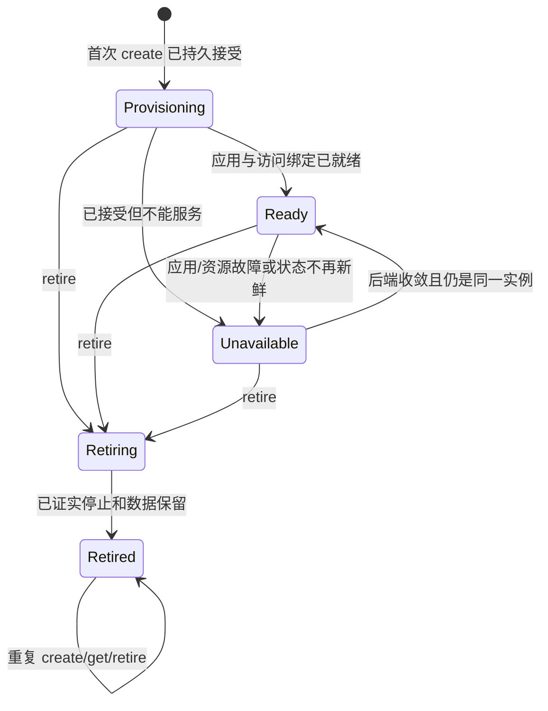

# Runtime Contract v1alpha1：中立资源契约

状态：**Proposed / 待审阅，未实现**。主 Issue：[multi-tenant #82](https://github.com/GuoMonth/dsh-multi-tenant/issues/82)。日期：2026-09-19。
本文是规范提案；配套 [Cell 映射](cell-binding-v1alpha1.zh-CN.md) 是其中一个实现。本稿不修改现有 Cell API 或已发布行为。

## 1. 范围与规范用语

本契约管理一个独立应用环境的分配、观测、永久退役和受控访问。它不解释 DSH Session/工具/聊天，不管理用户 OIDC，不规定 Pod/容器/进程实现。

“MUST/必须”是后端通过符合性验收的要求；“MAY/可以”是有边界的实现自由。v1alpha1 是拟定契约版本，不是 npm 版本、DSH 版本或 CRD 版本。

首期仅实现一种 deployment profile：持久数据、固定 DSH 模板、单实例浏览器入口。未来后端可实现相同核心，或明确拒绝无法提供的模板。兼容契约不代表安全等级等价。

## 2. 身份、对象与数据模型

以下 TypeScript 仅表示与语言无关的数据形状；实现语言不限。所有结构字段均必填，除显式 `?`；JSON 请求未知字段应拒绝，不能静默忽略拼错的归属/模板字段。

```ts
type UUID = string // 小写 canonical UUID；instanceKey 由平台生成随机 v4
interface InstanceKey {
  runtimeId: string // 管理员配置、稳定且不可复用的安装标识
  scopeId: string   // 安装内 opaque 管理范围，非浏览器选择项
  instanceKey: UUID // 一次分配的 key，退役后不能复用
}
interface InstanceRef extends InstanceKey {
  incarnation: string // 后端颁发；非空 opaque；调用方不能解析或生成
}
interface TemplateRef {
  name: string
  revision: string // 管理员登记的不可变修订，不能用 latest/可变别名
}
interface CreateIntent {
  contractVersion: 'v1alpha1'
  key: InstanceKey
  ownerRef: string // opaque 平台环境 ID，无邮箱/组/OIDC claim
  template: TemplateRef
}
type Phase = 'Provisioning' | 'Ready' | 'Unavailable' | 'Retiring' | 'Retired'
interface InstanceView {
  ref: InstanceRef
  ownerRef: string
  template: TemplateRef
  revision: string // opaque 观察版本，仅相等比较；不是全局有序数
  phase: Phase
  reason: string   // 稳定机器码；细粒度后端诊断不放公共字段
  observedAt: string // UTC RFC3339；适配器完成本次读取的时间，不是健康保证租约
  dataDisposition: 'Managed' | 'Retained'
}
interface AccessBinding {
  ref: InstanceRef
  bindingId: string // 短期 opaque 引用，不是可转让凭据
  application: 'dsh-web/v1'
  origin: string // 规范 HTTPS origin，无路径/用户信息/query/fragment
  expiresAt: string // UTC RFC3339；只限制建立新通道
}
```

`runtimeId/scopeId/ownerRef/template.name/revision/incarnation` 是精确、区分大小写的受限标识：UTF-8 长度 1–256 字节，禁止控制字符、首尾空白；不能自动 trim 或大小写归一。格式验证不代替管理员 allowlist 或授权。

身份不透明不等于可随意更改：runtimeId 不能在重装时悄悄指向另一个空集群；scopeId 已有关联资源后不能改指另一 namespace/目录。需要改变时注册新标识，显式绑定新实例。

一个 InstanceRef 跨应用进程重启保持不变，但不可跨资源重新分配复用。任何针对已知实例的操作必须携带完整 ref；仅 create 和首次结果未知时 get 可以使用 key。

模板和 ownerRef 在该分配中不可变。管理员变更底层构建映射必须产生新 template revision；不能以同一个 revision 偷换镜像/profile。首期不提供模板原地更新、滚动升级或卷导入。

## 3. 操作与线性化点

逻辑端口如下；`CallContext` 是宿主调用控制，不是协议 JSON。

```ts
interface RuntimePort {
  create(intent: CreateIntent, ctx: CallContext): Promise<InstanceView>
  get(key: InstanceKey, expectedIncarnation: string | undefined,
      ctx: CallContext): Promise<InstanceView>
  retire(ref: InstanceRef, ctx: CallContext): Promise<InstanceView>
  resolveAccess(ref: InstanceRef, ctx: CallContext): Promise<AccessBinding>
}
```

CallContext 包含受信服务身份/范围、截止时间和取消信号。不能让浏览器设置该服务身份。进程内实现从组合配置和凭据取得；未来远程绑定由 transport 认证，不接受 body 中自报角色。

### 3.1 create

1. 检查服务 scope、精确模板、不可变归属。平台已先持久保存 key。
2. **首次成功持久保存 key 对应资源记录是接受点**，返回后后端拥有执行与清理责任。可返回 Provisioning，不等待应用启动。
3. key 已存在且 CreateIntent 相同，返回同 incarnation 的当前记录；并发创建最多接受一个。差异返回 `IntentConflict`，不能 patch 成新意图。
4. 已是 Retiring/Retired 的相同意图，只返回该终态/退役过程，不重新激活；不同意图仍冲突。
5. 模板不支持/无权限必须在分配资源前拒绝。接受后故障由该资源状态表现，不能丢失记录并让上层换 key 重试。
6. create **不**是 ensure-running：Unavailable 不会因重复 create 变为新的分配；后端可按自身已声明策略恢复同一实例，但不能复用他人的资源。

比较意图按已验证字段逐项精确比较，不依赖 JSON 字段顺序、标签文本或不稳定的序列化 hash。实现可记录内部规范化 fingerprint，但冲突语义不因后端改变。

### 3.2 get

- 无记录返回 `NotFound`；明确携带 expectedIncarnation 且当前不同返回 `StaleInstance`。
- 权威查询不可用返回 `Unavailable`，不把旧缓存当 fresh 事实；`phase=Unavailable` 表示资源记录可读但应用目前不能服务，两者不同。
- `revision` 可用于缓存/观察去重，不能作为 writer fencing、实例身份或跨资源时序。
- watch 是 SDK 可选优化，不是核心远程操作；断线/版本过期后 get 重读。暂不承诺有序事件流或事件不丢失。
- 首期不提供全局 list/search inventory；平台只读取自身已保存的绑定，管理员用后端原生诊断。

### 3.3 retire

这是永久退役，不是暂停，不是删除持久数据，也不是平台 revoke。

- 必须匹配完整 ref。后端原子写入单调退役意图是接受点；晚到的 activate/create 不能覆盖它。
- 接受后返回 Retiring 或已经完成的 Retired；重复请求幂等。模板固定保留数据，调用方不能在退役时改成 destroy。
- 从接受退役意图开始，后续 resolveAccess/新通道准入必须拒绝。接受前已开始的请求/连接可能短暂存活，必须在 Retired 前由后端终止执行/连接。
- **Retired 后置条件**：该实例全部 owned 执行已停止、旧写入者不能继续写、入口已撤销、数据已按保留策略脱离运行资源清理；保留终态元数据。不能仅因为控制对象“不见了”就宣称完成。
- 无法证实停止时保持 Retiring 并提供可定位原因，允许人工修复和幂等重试；不能强删记录以伪造完成。
- 整个记录本应持久存在却 NotFound：返回 NotFound，不宣称已清理；平台显示“资源记录缺失，需核验”。管理员绕过协议清理资源不属于自动恢复承诺。

实例 record 保留是为抵抗迟到 create，不是备份。正常协议没有 purge；管理员离线清理记录前必须阻止所有旧调用源，放弃该 key 后续重试。首版不设计自动 tombstone GC。

### 3.4 resolveAccess

- 只允许服务身份范围内、ref 精确匹配、当前 Ready 且未退役的实例。
- 返回的 binding 不包含 PID、namespace、Pod、端口、内部 URL、Unix socket、平台会话或 DSH Cookie。
- binding 是后端 Connector 可识别的短期引用，建议 TTL 30 秒。过期后重取；过期仅禁止新连接，不能代替平台会话到期处理。
- origin 来自管理员受控应用入口策略，必须属于平台登记的 HTTPS origin 范围并绑定该 ref。接收方不能盲目信任不在部署配置内的 URL。
- resolveAccess 成功与发起请求间仍可能故障；Connector 在实际准入时重新验证 ref、退役意图与当前目标，失败关闭。不承诺跨两个调用的分布式事务。

## 4. 状态机与完成条件



Ready 需要模板身份一致、对应最新资源意图、原生应用就绪及部署访问前提满足；不是“Pod Running”。Ready 不是后续请求一定成功的承诺。Retired 不转回 Ready，新环境必须有新 key。

平台 desired 状态（谁获授权）与 runtime phase（资源事实）分离。不把用户被禁用写成 runtime Unavailable；不因用户退出改成 Retiring。

`dataDisposition=Retained` 仅在 Retired 时返回；其他状态为 Managed。保留范围包含模板指定的持久 data/private-state，不含内存、tmp、外部提供的 Secret；不保证任何未来模板能读取这些数据。

## 5. 取消、超时与错误

中立错误形状：`{code, effect, retry, message}`。message 脱敏，只用于诊断，调用方不得解析文本决定权限或资源状态。

- `effect`: `none | accepted | unknown`，针对本次调用是否已被接受；accepted 不代表完成。纯读取错误为 none。
- `retry`: `never | same-request | read-first`。截止时间/断网不能证明取消资源；写请求发出后超时为 unknown/read-first。

| code | 含义 | 下一步 |
| --- | --- | --- |
| InvalidArgument / UnsupportedVersion | 请求或版本无效，无副作用 | 修正请求 |
| Forbidden | 服务身份无该范围权限 | 不自动重试，不泄漏资源存在性 |
| UnsupportedTemplate | 后端无法满足该精确模板/策略 | 不降级，换明确获准的模板 |
| IntentConflict | key 已绑定不同 owner/template | 不接管，不自动换 key |
| StaleInstance | 同 key 的 incarnation 不符合预期 | 关闭连接，人工/平台核验新绑定 |
| NotFound | 无资源记录 | 已知 ref 不当作清理成功；首次 create 超时可用同意图重试 |
| NotReady / Retired | 不能新建访问通道 | 读取状态；Retired 永不自动重建 |
| Unavailable | 权威后端不可用/临时故障 | 有界退避，写入已发出时先读 |
| DeadlineExceeded / Cancelled | 仅请求等待已结束 | 写效果可能 unknown，重读同 key/ref |

MVP 客户端有界重试，建议指数退避 250ms 至 5s、单次交互最多 30s，然后展示仍在准备/结果未知；这些是 SDK 默认，不是服务 SLA。平台不得在 unknown 时换 key 再创建。

客户端上下文取消不隐含 retire。连接取消只关闭连接；对已接受的创建需要显式管理员退役，后端不能把不确定请求留成无主资源。

## 6. 应用通道绑定：与控制 JSON 分离

进程内 `RuntimeConnector` 是运行时提供的 transport 插件，不是另一个后台服务。它接受 AccessBinding 和已由平台清洗的 HTTP 请求/WS upgrade/流及本地 abort signal，将它们绑定到精确实例。Node 请求/响应对象仅属于 Node 语言绑定，不进入上述数据模型。

职责分配：

| 行为 | 平台 ingress | runtime Connector/launcher |
| --- | --- | --- |
| 用户身份/环境授权、CSRF/Origin 检查 | 必须 | 不解释用户身份 |
| 剥离 OIDC/平台 Cookie、Authorization/身份/forwarded 头 | 必须 | 防御性再次剥离配置的保留凭据 |
| 选择确切 ref/origin，拒绝浏览器 endpoint | 必须 | 复验 binding/ref/资源归属 |
| DNS/Service/socket/PID、内部 transport 凭据 | 不持有或推导 | 后端私有 |
| 原生 launch token、bootstrap Cookie 适配 | 不要求获取 token | launcher/profile 实现 |
| 原生 payload、流、WS、Fetch | 保持透明 | 保持透明 |
| 平台会话失效 | abort 所有对应代理流 | 响应 abort，不能回收整个实例 |

Connector 不接受任意 URL/port 开放代理，不发起任意外部重定向；connection-bound 的 binding 不可在不同 runtime/provider 间使用。后端若需要认证凭据，应在自己的受控 transport 内取得，不能把凭据暴露为平台公共返回字段。

实际准入与退役并发时，以后端读取/接受顺序确定：准入前已接受退役必须拒绝；准入先发生的连接归退役 drain/停止范围。无法跨网络保证纳秒级立即断连，Retired 才是完成屏障。平台管理员先关闭其连接，再调用 retire，有助于减少窗口但不能取代下层停止证明。

## 7. 模板、能力与扩展

首版模板是管理员配置的不可变记录，不新增模板 CRD/市场。上层负责允许哪些用户使用哪些 templateRef；下层保证该模板对应固定构建及实际配置。配置要求与实际后端不匹配时拒绝，不能只回一个 `secure: true` 标签。

模板同时约束：精确 DSH 版本、后端构建产物、插件/profile 只读边界、允许用户修改的设置、持久化/保留策略、网络/执行策略和应用 profile。是否适用于不可信工作负载必须有实际测试及部署前提；Process 和普通容器不能仅靠名称宣称强隔离。

不设通用 `extensions: any`、任意 shell/环境变量/挂载。未来新增 pause/snapshot/exec 需独立版本化扩展及符合性案例，未实现返回明确 Unsupported；不能修改 core retire 含义。核心实例 ID 可用于扩展，但 snapshotId、操作 ID、应用 Session ID 不混为一物。

## 8. 版本与依赖

契约版本、语言包版本、Cell CRD 版本和 DSH baseline 分开。首期构建组合固定 `v1alpha1`，不匹配则启动失败；本期不做动态版本协商服务。

alpha 期间字段/含义发生破坏性变化需升级契约版本并成对更新消费/提供方，不使用同名版本悄悄改变含义。新增后端只需满足规范与配置，不要求平台新增 backend switch。

未来 HTTP/RPC binding 若有真实独立部署需求，再定义路径、认证、状态码和流 transport。不能把本地 AbortSignal 或 Connector closure 序列化；远程服务须重新完成服务身份/调用范围/凭据边界验收。当前协议不是 OpenSandbox、OCI 或 Kubernetes CRI 的兼容实现。

## 9. 符合性测试清单（设计用例，尚未运行）

| ID | 输入/故障 | 必须观测到的结果 |
| --- | --- | --- |
| C01 | 并发 create 同 key/意图 | 一个 incarnation，同一 owner/template |
| C02 | 同 key 不同 owner/template | IntentConflict，原资源不变 |
| C03 | create 已接受但响应丢失 | get/同 key 重试得到原记录，无第二实例 |
| C04 | Retired 后重放旧 create | 返回原终态，零新增 writer |
| C05 | 旧 incarnation 调用 retire/resolveAccess | StaleInstance，不影响新资源 |
| C06 | 取消 create 等待 | 不隐含 retire，get 可找到已接受记录 |
| C07 | 平台 close/logout/revoke | 连接终止，运行时实例仍存在 |
| C08 | binding 过期、跨 runtime/scope/ref 使用 | 拒绝；bindingId 不作为浏览器凭据 |
| C09 | get 后 Pod 重建/目标变化 | 同实例可重连；错实例拒绝；不依赖旧 IP |
| C10 | retire 遇到无法确认停止的 writer | 保持 Retiring，不回 Retired |
| C11 | retire 重复、乱序、平台重启 | 同一单调终态，数据保留 |
| C12 | 后端不可用/返回过期 readiness | 拒绝新访问，不用缓存伪造 Ready |
| C13 | 不支持模板/可选功能 | 明确拒绝，不退化为弱保证 |
| C14 | 无权限访问其他 scope | Forbidden，不泄漏内部地址/凭据 |
| C15 | 真实应用 HTTP/WS/stream/Fetch | payload 保真，Origin/Cookie 正确，abort 关闭流 |
| C16 | 管理员绕过协议删资源记录 | 不将 NotFound 当 Retired，不自动认领外来资源 |
| C17 | 同 key 退役意图与创建调谐并发 | 退役最终收敛，无长期迟到 writer；Retired 前经过屏障 |
| C18 | backend 从 Cell 换为满足模板的测试 double | 上层核心无需 Kubernetes 类型/分支；这不证明 Process 已实现 |

单元测试覆盖数据及顺序，真实后端测试证明停止/隔离/持久化。对新后端的“兼容”结论必须同时满足两者。
