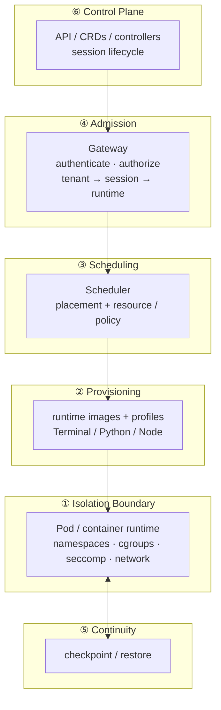

[简体中文](./architecture.zh-CN.md) | English

# Architecture — six layers

The project is one **isolated-runtime control plane** organized into six
layers. The bottom layer is the isolation primitive itself — a kernel-enforced
Pod / container boundary; every layer above it decides *where* a session runs
and *how* it is provisioned, resumed, and orchestrated, without ever placing
isolation *inside* a shared process. This document is the global map the
individual specs and ADRs are anchored to.

## The six layers

| # | Layer | Artifact | Responsibility | Status |
| --- | --- | --- | --- | --- |
| ① | **Isolation boundary** | Pod / container runtime | The kernel-enforced primitive: namespaces, cgroups, seccomp, network policy. One tenant, one boundary. | 🚧 Kubernetes-native; runtime-agnostic deferred |
| ② | **Provisioning** | runtime images + profiles | What runs: standard images per workload (Terminal / Python / Node), versioned profile contract. | 🚧 |
| ③ | **Scheduling** | Scheduler | Where it runs: placement onto a runtime with resource + security-policy constraints. | 🚧 |
| ④ | **Admission** | Gateway | Entry: authenticate / authorize, resolve tenant → session → runtime, fail-closed. | 🚧 |
| ⑤ | **Continuity** | checkpoint/restore | Resumability: snapshot + resume a session's runtime state across rescheduling. | ⏳ mechanism TBD |
| ⑥ | **Control plane** | API / CRDs / controllers | The orchestrating surface that composes ①–⑤; session lifecycle (create / resume / delete). | 🚧 |

## Diagram



## Request flow

1. **④ Admission** — a session request arrives at the Gateway; it is
   authenticated and authorized, and the Gateway resolves *which tenant, which
   session, which runtime*. This is the single place where "never share a
   runtime" is decided; anything unresolved is denied (fail-closed).
2. **③ Scheduling** — the Scheduler places the session onto a concrete runtime
   (a Pod) under resource and security-policy constraints. The placement
   decision is exposed as a stable interface, not a Kubernetes-specific call.
3. **② Provisioning** — the workload's runtime image and profile (Terminal /
   Python / Node, …) are resolved into a concrete container spec.
4. **① Isolation boundary** — the Pod launches; the container runtime enforces
   the boundary (namespaces, cgroups, seccomp, network). The tenant's code,
   plugins, and filesystem cannot escape into a neighbour or the host.
5. **⑤ Continuity** — on rescheduling, checkpoint/restore snapshots the
   runtime's state and resumes it in a new boundary, so isolation does not cost
   session continuity.
6. **⑥ Control plane** — the API / CRDs / controllers orchestrate ①–⑤ across the
   session lifecycle.

## Dependency direction (one-way)

```
Control plane  ──▶  runtime interface  ──▶  isolation boundary
   (⑥ ③ ④)          (container runtime)        (①)
```

- The **control plane** (⑥ orchestration, ③ Scheduler, ④ Gateway) is
  **runtime-agnostic**: it talks to a container-runtime interface, not to
  Kubernetes directly. A pull request that hard-codes Kubernetes into the
  control plane is rejected.
- **Isolation is enforced only at ①.** No layer above the boundary may carry the
  invariant as a shared-code convention — that is `dsh-multi-tenant`'s job, not
  this project's.
- **② Provisioning** owns the profile contract; **⑤ Continuity** owns the
  snapshot/restore contract. Sibling layers do not reach through one another's
  implementations.

## Kubernetes-native is a starting point, not a conclusion

The initial backend is Kubernetes (one tenant, one Pod). "Runtime-agnostic" is
currently a *hypothesis*, not a proven property: the control plane is designed
against a container-runtime interface, but that interface has not yet been
exercised by a second backend (Docker / Firecracker / Nomad). The interface is
only promoted from sketch to contract once a second backend implements it — see
ROADMAP's deferred "runtime-agnostic backend" milestone.

Likewise, the **⑤ Continuity** mechanism is decision-gated: CRIU-style
kernel checkpoint, runc/containerd checkpoint APIs, or an in-process snapshot
are all open. No checkpoint contract is frozen until a mechanism is
demonstrated against the real runtime.

## Layer → doc map

| Layer | Docs |
| --- | --- |
| ① Isolation boundary | `../README.md` — isolation boundary = runtime primitive |
| ② Provisioning | ROADMAP M4 (runtime images) |
| ③ Scheduling | ROADMAP M1 |
| ④ Admission | ROADMAP M2 (Gateway) |
| ⑤ Continuity | ROADMAP M3 (checkpoint/restore) |
| ⑥ Control plane | ROADMAP M0–M5 |
