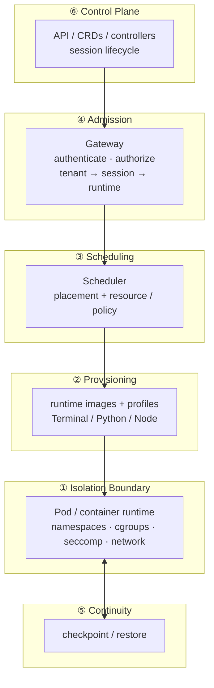

[English](./architecture.md) | 简体中文

# 架构 —— 六层

本项目是一个**隔离运行时控制平面**，组织为六层。最底层是隔离原语本身——由内核强制
的 Pod / 容器边界；其上每一层决定会话在*哪里*运行、*如何*被供给、恢复与编排，而从不
把隔离放进共享进程*内部*。本文档是各规格与 ADR 所锚定的全局图。

## 六层

| # | 层 | 工件 | 职责 | 状态 |
| --- | --- | --- | --- | --- |
| ① | **隔离边界** | Pod / 容器运行时 | 内核强制的原语：命名空间、cgroup、seccomp、网络策略。一个租户一个边界。 | 🚧 Kubernetes 原生；运行时无关延后 |
| ② | **供给** | runtime images + profiles | 运行什么：按工作负载（Terminal / Python / Node）的标准镜像，版本化的 profile 契约。 | 🚧 |
| ③ | **调度** | Scheduler | 在哪里运行：在资源与安全策略约束下，把会话调度到某个运行时。 | 🚧 |
| ④ | **准入** | Gateway | 入口：认证 / 授权，解析 租户 → 会话 → 运行时，默认拒绝。 | 🚧 |
| ⑤ | **连续性** | checkpoint/restore | 可恢复性：跨重调度快照并恢复会话的运行时状态。 | ⏳ 机制待定 |
| ⑥ | **控制平面** | API / CRDs / controllers | 编排 ①–⑤ 的编排 surface；会话生命周期（create / resume / delete）。 | 🚧 |

## 图示



## 请求流程

1. **④ 准入** —— 会话请求到达 Gateway；它被认证与授权，Gateway 解析出*哪个租户、哪个
   会话、哪个运行时*。这是"绝不共享运行时"这一决策的唯一地点；任何无法解析的内容都被
   拒绝（默认拒绝）。
2. **③ 调度** —— Scheduler 在资源与安全策略约束下，把会话调度到某个具体运行时（Pod）。
   调度决策以稳定接口暴露，而非 Kubernetes 特有的调用。
3. **② 供给** —— 工作负载的运行时镜像与 profile（Terminal / Python / Node、……）被解析为
   具体的容器 spec。
4. **① 隔离边界** —— Pod 启动；容器运行时强制边界（命名空间、cgroup、seccomp、网络）。
   租户的代码、插件与文件系统无法逃逸到相邻租户或宿主机。
5. **⑤ 连续性** —— 重调度时，checkpoint/restore 快照运行时状态并在新边界中恢复，使隔离
   不以牺牲会话连续性为代价。
6. **⑥ 控制平面** —— API / CRDs / controllers 在会话生命周期内编排 ①–⑤。

## 依赖方向（单向）

```
Control plane  ──▶  runtime interface  ──▶  isolation boundary
   (⑥ ③ ④)          (container runtime)        (①)
```

- **控制平面**（⑥ 编排、③ Scheduler、④ Gateway）是**运行时无关**的：它面向容器运行时
  接口，而非直接面向 Kubernetes。将 Kubernetes 硬编码进控制平面的 PR 会被拒绝。
- **隔离只在 ① 强制执行。** 边界之上的任何层都不得以共享代码约定的方式承载这一不变量——
  那是 `dsh-multi-tenant` 的职责，而非本项目。
- **② 供给**拥有 profile 契约；**⑤ 连续性**拥有快照/恢复契约。兄弟层之间不互相穿透对方
  的实现。

## Kubernetes 原生是起点，而非结论

初始后端是 Kubernetes（一个租户一个 Pod）。"运行时无关"目前是*假设*而非已证明的性质：
控制平面针对容器运行时接口设计，但该接口尚未被第二个后端（Docker / Firecracker / Nomad）
实践过。只有当第二个后端实现该接口后，它才会从草图升格为契约——参见 ROADMAP 中延后的
"运行时无关后端"里程碑。

同样，**⑤ 连续性**的机制是待决策的：CRIU 风格的内核 checkpoint、runc/containerd
checkpoint API，或进程内快照都是开放选项。在针对真实运行时验证出某个机制之前，不冻结
任何 checkpoint 契约。

## 层 → 文档映射

| 层 | 文档 |
| --- | --- |
| ① 隔离边界 | `../README.md` —— 隔离边界 = 运行时原语 |
| ② 供给 | ROADMAP M4（runtime images） |
| ③ 调度 | ROADMAP M1 |
| ④ 准入 | ROADMAP M2（Gateway） |
| ⑤ 连续性 | ROADMAP M3（checkpoint/restore） |
| ⑥ 控制平面 | ROADMAP M0–M5 |
